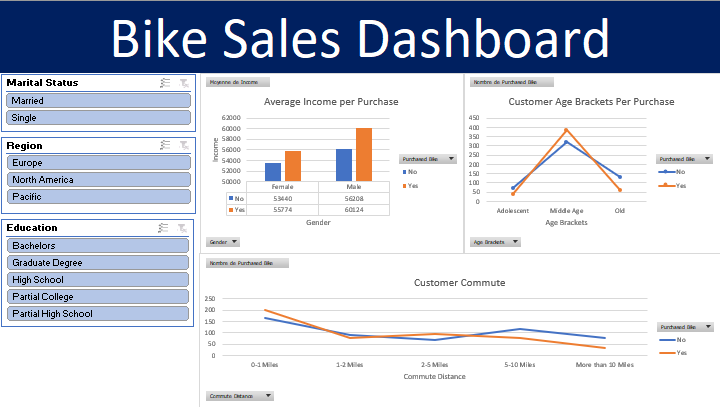

# Bike Sales Data Analysis with Excel : Project Overview

It's a pure spreadsheets project using Excel that has the purpose of analyzing a dataset about bike sales. It contains three parts: data cleaning and setting up, data analysis and gathering insights using pivot tables and at the end a dashboard that covers the main conclusions and ideas got from the data we have.

## Data Cleaning

* Removed all duplicates from the dataset
* Modified values of both columns Marital Status & Gender for the readability of our data and to understand more these fields (for e.g. M to Married for Marital Status and M to Male for Gender).
* Changed the type of Income feature to Currency type and removed useless digits before comma.
* Created brackets and ranges for Age variable.
* Set "10+ Miles" option up of Commute Distance Field to "More than 10 Miles" so that all categories in this column could be presented and sorted the right way within charts created later.

## Data Exploration

In this part of the project, we created three pivot tables and three charts to more comprehend our data and extract all possible conclusions from them :
* The first one is used to clarify the relationship between a person's income and the possibility for them to purchase a bike whether they are a male or female.
* The second one has showed the effect of commute distance on purchasing a bike for all people described in our data.
* The last one has declared which age category customers tend to buy a bike for their daily purposes.

## Dashboarding

At last, we used all charts created already with the pivot tables to make a clear and concise dashboard to resume our findings upon our data using some filter buttons to make our dashboard a way more intercative:
  

